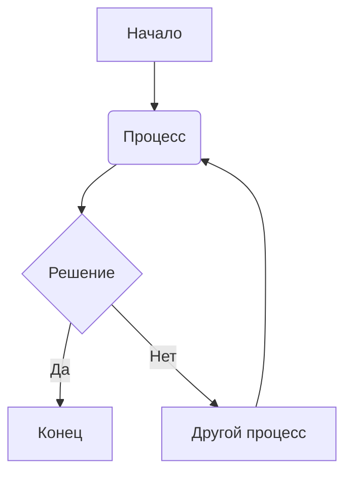
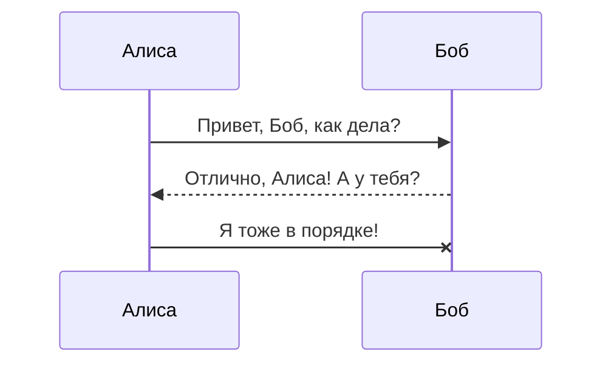
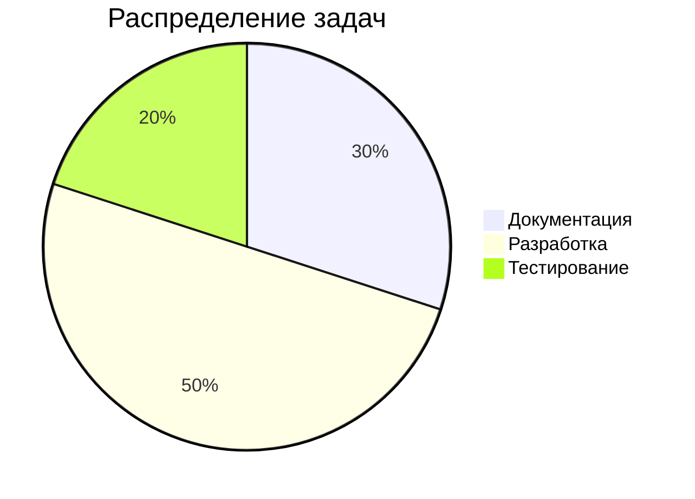

# Диаграммы и графики (Mermaid)

**Mermaid** — это расширение, которое позволяет создавать сложные диаграммы и графики, используя текстовое описание. Это невероятно мощный инструмент для визуализации процессов, структур и данных.

---

### Как использовать

Вы создаете блок кода и указываете язык `mermaid`. Внутри этого блока вы пишете код, описывающий вашу диаграмму.

### Примеры

#### Блок-схема (Flowchart)

**Шаблон:**

**Результат:**

---

#### Диаграмма последовательности (Sequence Diagram)

**Шаблон:**

**Результат:**

---

#### Круговая диаграмма (Pie Chart)

**Шаблон:**

**Результат:**

У Mermaid есть еще множество других типов диаграмм. Подробнее можно почитать в [официальной документации](https://mermaid.js.org/syntax/classDiagram.html).
